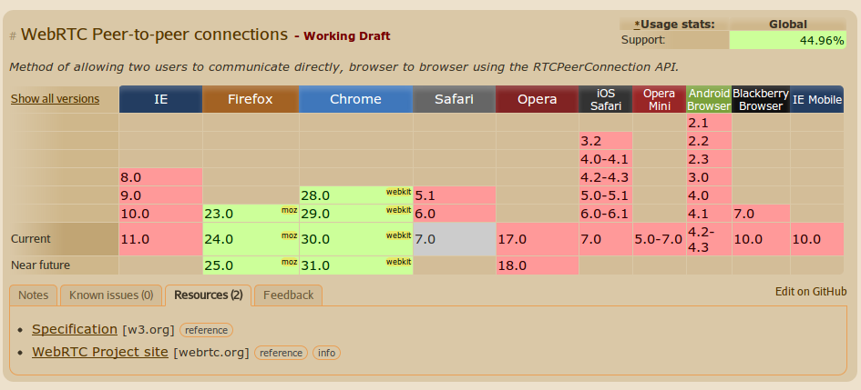
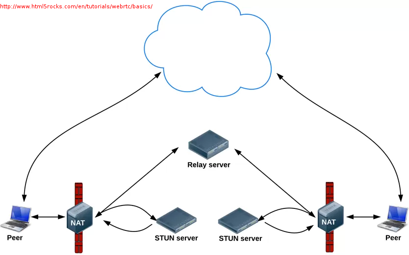
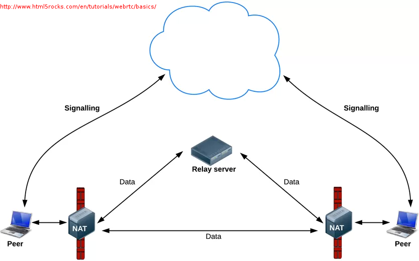
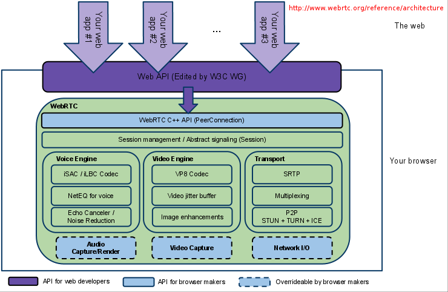
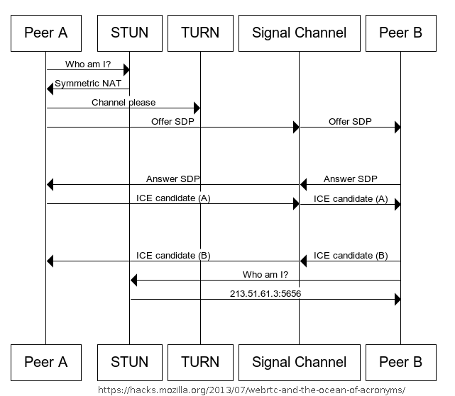
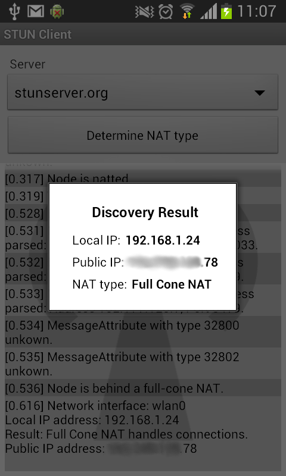
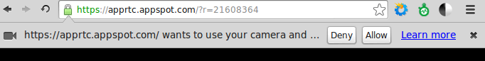
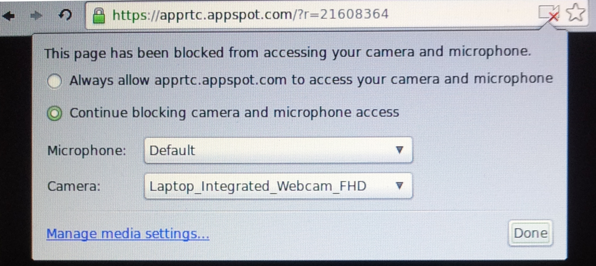
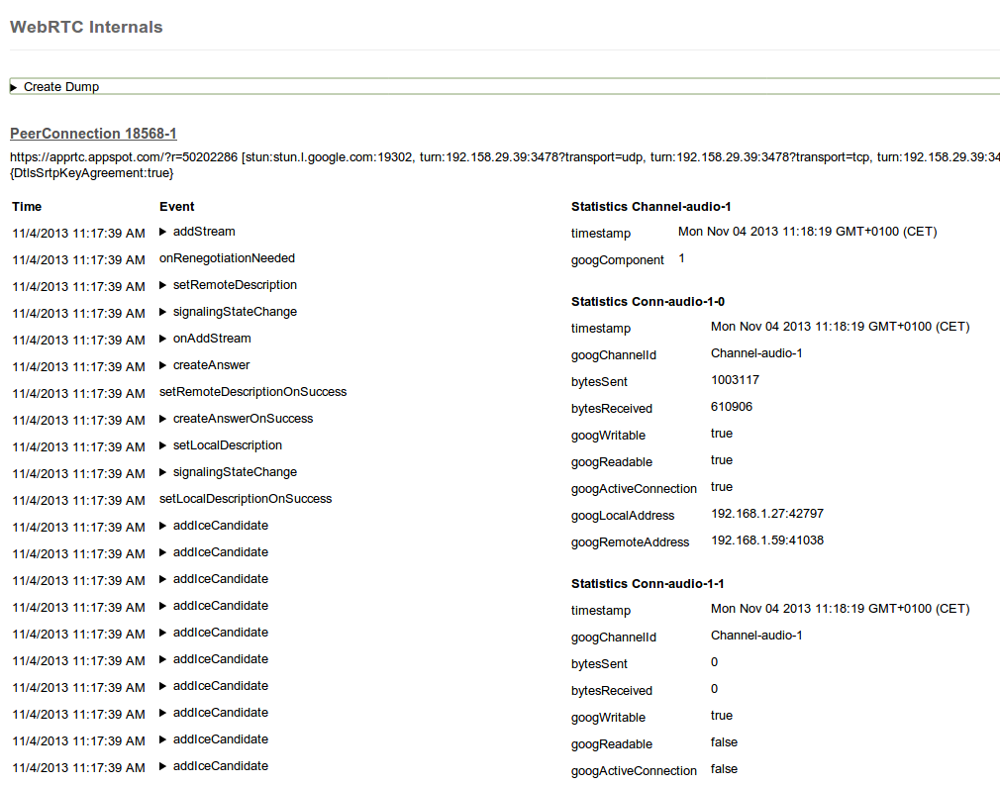
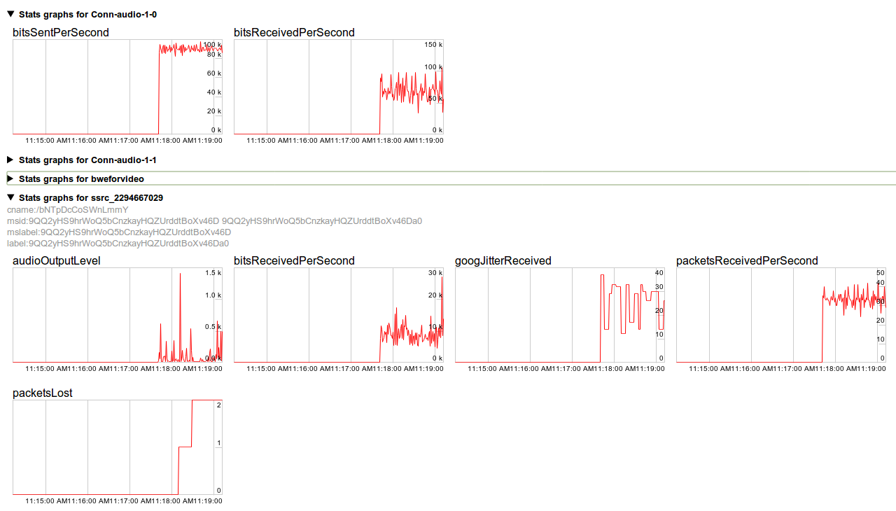

# Web RTC

<!-- .slide: class="page-title" -->


## Plan

<!-- .slide: class="toc" -->

- [Introduction](#/1)
- [JavaScript](#/2)
- [AJAX](#/3)
- [Web Messaging](#/4)
- [Server Sent Events](#/5)
- [WebSocket](#/6)
- **[Web RTC](#/7)**
- [Web Workers](#/8)
- [Conclusion](#/9)

Notes :


## Plan

- Introduction
- Support
- Acronymes et notations
- Architecture et Fonctionnement
- L'API
- Sécurité
- Extensions et nouvelles API
- Outils et Ressources
- Limitations et Interopérabilité
- Exemples d'utilisation
- Conclusion

Notes :


## Introduction

- Web RTC : Real Time Communication
- Pourquoi :
  - Permettre une communication directe entre 2 clients
  - Pas de plugin – Pas de logiciel tiers
  - Transparent et Interopérable d'un navigateur à l'autre
  - Transfert de données, audio et vidéo
  - VoIP, Peer2Peer, Jeux multi-joueurs, ...

- Contraintes :
  - Firewalls et NAT
  - Adressage unique d'une ip locale à une autre, sans serveur
  - Sécurité des échanges

Notes :


## Support

- Compatibilité



Notes :


## Acronymes et notations

- Peer : Pair participant à une connexion
    - Client, ordinateur, smartphone, …
- ICE : Interactive Communication Establishment
    - Développé par l'IETF – RFC5245
- ICE Candidate : Combinaison d'informations de connexion
- STUN : Session Traversal Utilities for NAT
    - Utilitaire de découverte de son ip et de la configuration réseau pouvant affecter la connexion à un pair
- TURN : Traversal Using Relays around NAT
    - Serveur de contournement / relai de NAT

Notes :


## Acronymes et notations

- SDP : Session Description Protocol
    - Standard de description de contenu multimédia (résolution, format, codecs...) IETF – RFC 4566
- Offer/Answer/Signal Channel : Mise en relation de A et B
    - A souhaite communiquer avec B
    - A envoie une Offer à B sur un Signal Channel B
    - B renvoie une Answer contenant une SDP
- MediaStream : Flux audio ou video
    - Potentiellement plusieurs canaux
    - Obtenu via navigator.getUserMedia()

Notes :


## Architecture et Fonctionnement



- Recherche de candidats de connexion entre 2 peer
Signal Channel

Notes :


## Architecture et Fonctionnement

- Echange de données entre 2 peer


Signal Channel

Notes :


## Architecture et Fonctionnement

- Cette API n'est pas déconnectée d'internet ou de toute forme de serveurs
- Internet va servir pour porter le SignalChannel et l'établissement de la communication entre les 2 peers
- La connexion en local sur un réseau LAN est également possible
- La notion de `SignalChannel` est beaucoup utilisée dans la documentation mais ne fait pas partie de l'API. C'est à chaque application de mettre en place ce système pour établir la connexion entre 2 peers souhaitant communiquer

Notes :


## Architecture et Fonctionnement



Notes :


## Architecture et Fonctionnement

- L'API RTCPeerConnection isole la complexité de tous les traitements effectués par le navigateur et le code sous-jacent :
  - Gestion des pertes de packets
  - Suppression de l'écho
  - Ajustement automatique de la bande passante
  - Gestion dynamique d'un tampon des packets
  - Contrôle automatique du gain
  - Réduction/Suppression du bruit
  - Nettoyage de l'image

Notes :


## Architecture et Fonctionnement

- L'API ne gère pas que l'audio et la vidéo. On peut aussi envoyer des données binaires grâce à RTCDataChannel :
  - Possibilité d'avoir plusieurs canaux, priorisés
  - Sémantique de livraison fiables et peu fiables
  - Gestion automatique de l'encombrement
  - Sécurité intégrée
  - Utilisable avec ou sans l'audio/vidéo

Notes :


## L'API : préfixes

- Obtenir les objets de l'API nécessite d'utiliser les préfixes

```javascript
var RTCPeerConnection = window.mozRTCPeerConnection ||
  window.webkitRTCPeerConnection;

var RTCIceCandidate = window.mozRTCIceCandidate ||
  window.RTCIceCandidate;

var RTCSessionDescription = window.mozRTCSessionDescription ||
  window.RTCSessionDescription;

var getUserMedia = navigator.getUserMedia ||
  navigator.mozGetUserMedia ||
  navigator.webkitGetUserMedia;
```

Notes :


## L'API : Créer une connexion

- `DtlsSrtpKeyAgreement` : interopérabilité Chrome / Firefox
- `RtpDataChannels` : Datachannel pour Firefox

```javascript
var pc = new RTCPeerConnection(servers, options);

var servers = {
  iceServers: [
    {url: "stun:stun.l.google.com:19302"},
    {url: "turn:numb.viagenie.ca", credential: "html5rtc", username: "user@html5.fr"}
  ]
};

var options = {
  optional: [
    {DtlsSrtpKeyAgreement: true},
    {RtpDataChannels: true}
  ]
};
```

Notes :


## L'API : Créer une connexion

- API RTCPeerConnection (extrait)

```
RTCPeerConnection {

  iceConnectionState: String
  iceGatheringState: String
  localDescription: RTCSessionDescription
  remoteDescription: RTCSessionDescription

  onaddstream: EventHandler
  ondatachannel: EventHandler
  onicecandidate: EventHandler

  addIceCandidate: Function
  addStream: Function
  close: Function
  createAnswer : Function
  createDataChannel: Function
  createOffer: Function
  setLocalDescription: Function
  setRemoteDescription: Function
}```

Notes :


## L'API : Initialisation d'une connexion



Notes :


## L'API : Création d'une Offer

- Pour se connecter à un peer, il faut créer une Offer et la lui transmettre. Il faut également la définir comme LocalDescription de notre connexion :

```javascript
pc.createOffer(function (offer) {
  pc.setLocalDescription(offer);

  send("offer", JSON.stringify(offer)); // pseudo-code
}, errorHandler, constraints);

var errorHandler = function (err) {
  console.error(err);
};

var constraints = {
  mandatory: {
    OfferToReceiveAudio: true, // demande l'audio
    OfferToReceiveVideo: true // demande la video
  }
};
```

Notes :


## L'API : Création d'une Answer

- Lorsque le destinataire reçoit l'`offer`, il doit la définir comme `RemoteDescription` puis renvoyer une `Answer` pour compléter la mise en relation, en se l'assignant comme `LocalDescription` :

```javascript
var pc2 = new RTCPeerConnection(servers, options); // peer 2

recv("offer", function (offer) { // pseudo-code

  var desc = new SessionDescription(JSON.parse(offer))
  pc2.setRemoteDescription(desc);

  pc2.createAnswer(function (answer) {
  pc2.setLocalDescription(answer);

  send("answer", JSON.stringify(answer)); // pseudo-code
}, errorHandler, constraints);

});
```

Notes :


## L'API : Ouverture de la connexion

- A la réception de l'answer par le Peer 1, celui-ci se l'assigne en tant que RemoteDescription pour compléter la description de la connexion qui lie les 2 Peers
- Tant que la description n'a pas été assignée, on ne peut pas ajouter d'ice candidate. (sinon une erreur est levée)
- Une fois la connexion ouverte, les Peers pourront récupérer les flux audio et vidéo, et s'échanger des données via les DataChannels

```javascript
recv("answer", function (answer) { // pseudo-code

  var desc = new SessionDescription(JSON.parse(answer))
  pc.setRemoteDescription(desc);

});
```

Notes :


## L'API : Recherche d'ICE



- Pour se connecter, les peers doivent aussi échanger des informations de connexion
- Pour cela, le navigateur contacte les serveurs stun/turn renseignés dans la configuration de la connexion
- Le serveur stun retourne des informations similaires à ceci :
- Le navigateur crée ensuite des candidats ICE pour notre connexion

Notes :


## L'API : ICE Candidates

- Lorsqu’un candidat ICE est trouvé (combinaison d'informations de connexion), un évènement icecandidate est lancé par le navigateur. Il faut alors le transmettre au pair avec lequel on souhaite communiquer :
- Le pseudo-code correspond à la notion de SignalChannel et peut être effectué par xhr ou avec socket-io par exemple

```javascript
pc.onicecandidate = function (e) {
if (e.candidate == null) { return }
  send("candidate", JSON.stringify(e.candidate)); // pseudo-code
  pc.addIceCandidate(new RTCIceCandidate(e.candidate));
};
```

Notes :


## L'API : échanger des données

- Pour échanger des données via WebRTC, il faut utiliser les DataChannel :

```javascript
// Peer 1
var channel = pc.createDataChannel(channelName, channelOptions);
var channelOptions = {}; // vide pour l'instant car mal supporté

channel.onmessage = function(evt){ console.log('message'); };

// Peer 2
pc.ondatachannel = function(evt){
  var channel = evt.channel;

  channel.onmessage = function(evt){ console.log('message'); };
};
```

Notes :


## L'API : échanger des données

- Pour envoyer les données, on utiliser la méthode send, comme pour l'API WebSockets
- Il est également possible de suivre l'état du channel via différents évènements :

```javascript
// Envoi de données
channel.send("Hello you !");

channel.onopen = function(evt){ console.log('open'); };
channel.onerror = function(error){ console.log('error'); };
channel.onmessage = function(evt){ console.log('message'); };
channel.onclose = function(evt){ console.log('close'); };
```

Notes :


## L'API : échanger des données

- `channelName` est une string identifiant le `datachannel` et ne doit pas contenir d’espace, sinon Chrome échouera
- `send` n’accepte que les types suivants : `String`, `Blob`, `ArrayBuffer`, `ArrayBufferView`
- Syntaxe proche de celle des WebSockets
- RTCDataChannel peut être plus puissant que les WS pour échanger de la donnée car il n'y a aucun intermédiaire.

Notes :


## L'API : échanger des données

|                     | WebSocket    | DataChannel  |
|---------------------|--------------|--------------|
| Encryption          | configurable | toujours     |
| Fiabilité           | fiable       | configurable |
| Livraison           | ordonné      | configurable |
| Multiplexé          | non          | oui          |
| Transmission        | message      | message      |
| Transferts binaires | oui          | oui          |
| Transferts UTF-8    | oui          | oui          |
| Compression         | non          | non          |
| Relais              | serveur      | P2P          |


- L'API DataChannel ressemble volontairement beaucoup à l'API WebSocket :

Notes :


## L'API : échanger des données

- API RTCDataChannel (extrait)

```
RTCDataChannel {

  id: Number
  binaryType: String
  bufferedAmount: Number
  label: String
  readyState: String
  reliable: Boolean
  ordered: Boolean

  onclose: EventHandler
  onerror: EventHandler
  onmessage: EventHandler
  onopen: EventHandler

  send : Function
  close: Function
}
```

Notes :


## L'API : Audio et Vidéo

- Selon le navigateur, URL.createObjectURL n'est pas forcément nécessaire et le stream peut être affecté directement au src.

```
// Peer 1
// Dans la page HTML
<video id="mediaViewer" autoplay></video>

// Dans le javascript
var video = document.getElementById("mediaViewer");

var constraints = {
  video: true,
  audio: true
};

navigator.getUserMedia(constraints, function (stream) {
  pc.addStream(stream);
  video.src = URL.createObjectURL(stream); // Blob URL
}, errorHandler);
```

Notes :


## L'API : Audio et Vidéo

- `getUserMedia` récupère le flux audio/vidéo. Il prend en paramètres des contraintes et 2 callbacks : succès et erreur
- La communication étant déjà établie via notre peerConnection, Peer 2 doit seulement réagir à l'évènement d'ajout de stream pour le récupérer

// Peer 2
```html
<video id="mediaViewer2" autoplay></video>
```
```javascript
var video = document.getElementById("mediaViewer2");
pc2.onaddstream = function (evt) {
  video.src = URL.createObjectURL(evt.stream);
};
```

Notes :


## L'API : Audio et Vidéo

- Le flux peut également être utilisé par l'API Web Audio, le Canvas, WebGL...
- L'appel à getUserMedia déclenche l'affichage de la barre d'autorisation proposée à l'utilisateur pour activer le micro / la caméra. Sous certaines conditions, cette demande ne sera faite qu'une fois
    - HTTPS, extensions, …
- getUserMedia lancera une erreur si la page n'est pas servie depuis un serveur
    - PERMISSION_DENIED: 1
- constraints définit les paramètres audio/vidéo, résolution, ...

Notes :


## L'API : Audio et Vidéo

- La caméra et le micro ne peuvent pas être utilisés sans l'accord explicite de l'utilisateur
- Qu'il peut révoquer à tout moment :





Notes :


## L'API : Audio et Vidéo

- API MediaStream (extrait)

```
MediaStream {
  id : String
  label : String

  readyState : short

  onaddtrack : EventHandler
  onended : EventHandler
  onremovetrack : EventHandler

  getAudioTracks: Function
  getVideoTracks: Function
  stop : Function
}
```

Notes :


## Sécurité

- Chiffrement des données et flux audio/vidéo par le navigateur
- Possibilité de rajouter un chiffrement supplémentaire comme OTR
- Optin explicite pour audio et vidéo (permanent ou simple)
- Utilisation de protocoles sécurisés : DTLS / SRTP
- Encore beaucoup de discussionsDiscussion complète : http://www.ietf.org/proceedings/82/slides/rtcweb-13.pdf

Notes :


## Limitations et Interopérabilité

- Pour Chrome :
  - Selon la version, il peut être nécessaire d'activer un flag :
    - chrome://flags
    - Enable screen capture support in getUserMedia()

  - Flag nécessaire pour les data channels :
    - Enable RTCDataChannel / enable-sctp-data-channels

  - MediaStream à convertir en BlobURL avant de l'assigner à la source d'un élément vidéo
  - Ne pas démarrer sur un fichier statique car les permissions ne sont pas accordées

Notes :


## Limitations et Interopérabilité

- Firefox :
  - Pas de support de TURN pour le moment (29/10/2013)
  - Une fois qu’une PeerConnection est établie, on ne peut pas en modifier les paramètres
  - Maximum un flux audio et un video par RTCPeerConnection
  - API Recording non implémentée

Notes :


## Extensions et nouvelles API

- API Web Audio : Accès au micro
- API Recording pour enregistrer les flux audio et vidéo (déjà faisable à la main)
- chrome.tabCapture : partage d'écran
- Utilisation de techniques de MCU pour communiquer à plusieurs
    - Multipoint Control Unit

Notes :


## Outils et ressources

- chrome://webrtc-internals
- Polyfill uniformisant les préfixes, disponible via webrtc.org
    - https://code.google.com/p/webrtc/source/browse/trunk/samples/js/base/adapter.js
- Wireshark
- http://www.html5rocks.com/en/tutorials/webrtc/basics/
- https://bitbucket.org/webrtc/codelab
- http://chimera.labs.oreilly.com/books/1230000000545/ch18.htm
- http://webrtchacks.com/
- http://www.webrtcbook.com/

Notes :


## Outils et ressources : webrtc-internals



Notes :


## Outils et ressources : webrtc-internals



Notes :


## Limitations et Interopérabilité

- Le reste du monde :
  - WebRTC peu ou pas supporté
  - Seules les communications 1-1 sont supportées
  - Microsoft a proposé une révision du standard
    - CU-RTC-Web

  - Mise à disposition d'un polyfill pour uniformiser l'API
  - Normalement intéropérable avec d'autres technologies
    - SIP, Phono, ...

Notes :


## Exemples d'utilisation

- https://apprtc.appspot.com : simple démo audio + vidéo
- http://idevelop.ro/ascii-camera/ : flux vidéo transformé en ascii
- http://shinydemos.com/facekat/ : jeu avec contrôle facial
- http://webcamtoy.com/app : effets avec WebGL du flux vidéo
- https://rtccopy.com : chat et transfère de fichiers P2P
- https://www.cubeslam.com/ : jeu HTML5 avec communication par datachannels

Notes :


<!-- .slide: class="page-questions" -->

<!-- .slide: class="page-tp6" -->
